# Pandemic drives you crazy? Take some snacks as Energy Supplyments!

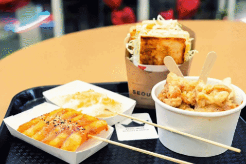

\
Does COVID-19 pandemic affect your life? YES for everyone! It has rapidly made our day to day life, businesses, activities, everything much harder than before, especially for dining! Recently, after a 10-month-long “staying home” life, I am really into street snacks! It’s hard to dine in the restaurants or spend too much time outside, and I found snacks are a perfect choice during the spare time. And this post is just about the BEST street snacks all around metro Vancouver! 

\
If you are a fan of foods, you’ll find this post could be a guideline for you to eat all over the town! The dataset is from Yelp API, the base dataset includes the following sectors:

```python
url = 'https://api.yelp.com/v3/businesses/search'

params={
        'location':loc,
        'radius':10000,
        'price':1,
        'term':terms,
        'categories':'Food',
        'limit':50,
        'sort_by':'rating'
        }

response=requests.get(url,params=params)
```
\
We focused on the Greater Vancouver area for the most and retrieved 50 top-rating stores from Downtown Vancouver, Vancouver West, Metrotown Burnaby, and Richmond city center. The price level was limited to “$” since snacks are averagely lower than CAD 20.

\
Example:
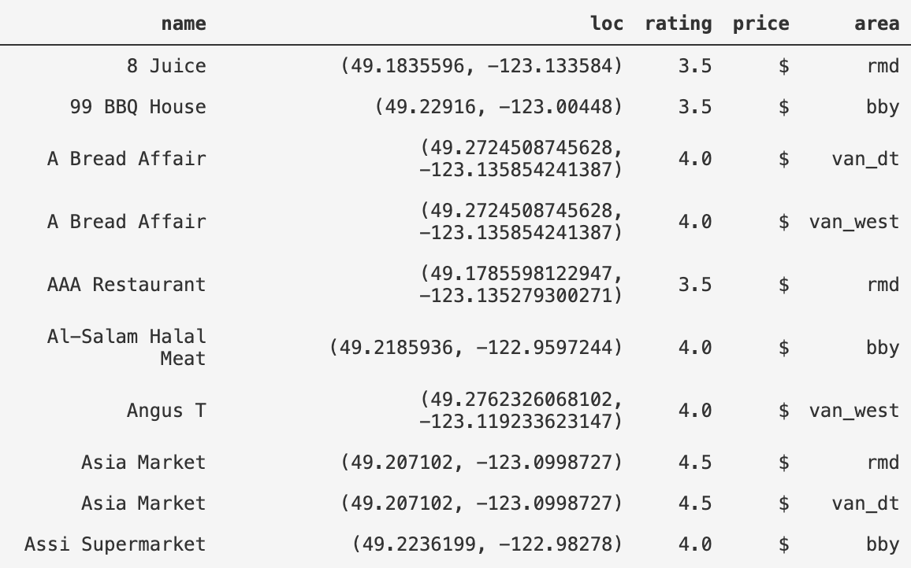

\
For each selected store, we have its unique location in latitude and longitude, and we used Google Places API and Python library gmplot to plot a [heatmap](heatmap.html) to look at the distribution virtually.

\
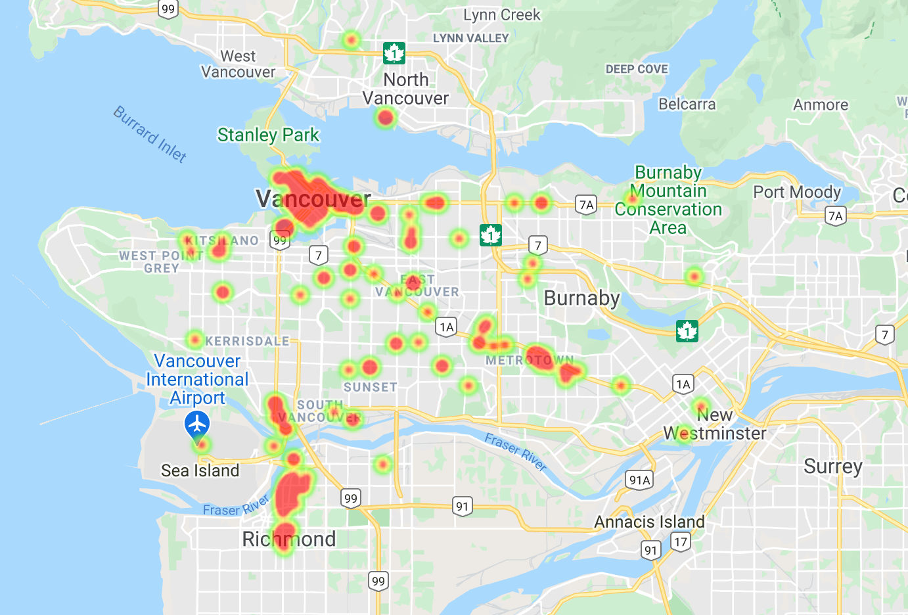
\
Map of top-rated snack locations in Greater Vancouver.

\
As the above map shows, 3 areas concentrated the most snack stores, which are Downtown Vancouver, Richmond North, and Metrotown. Since we already eliminated low-rating stores at the beginning, the score distribution is showing below:
\
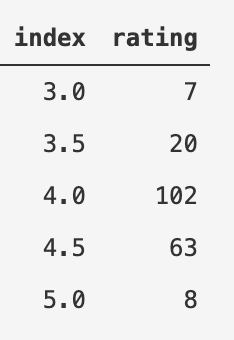
\
And we can also look at the specific area: In Downtown Vancouver, most stores are rating between 4-5.

\
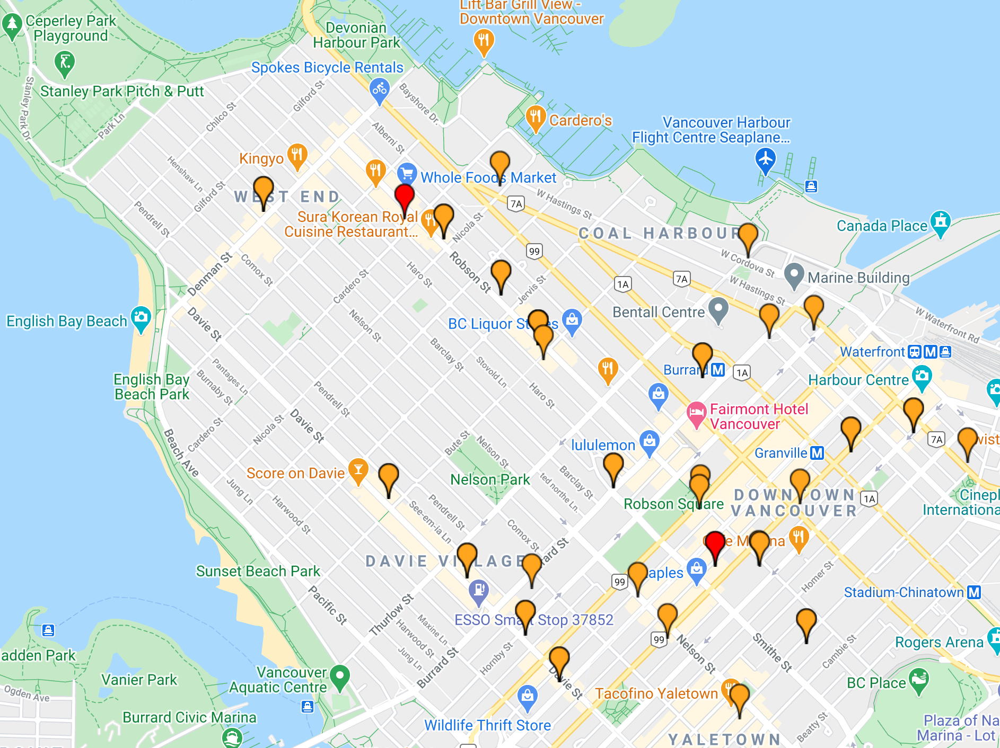

\
 The best ones are:
## 1. Incognito Coffee
Address: School Of Music, 843 Seymour Street Atrium of VSO, Vancouver, BC V6B 3L4\
Website: [incognitocoffee.ca](incognitocoffee.ca)\
Phone: (604) 428-3888

- In-store pick-up
- Delivery

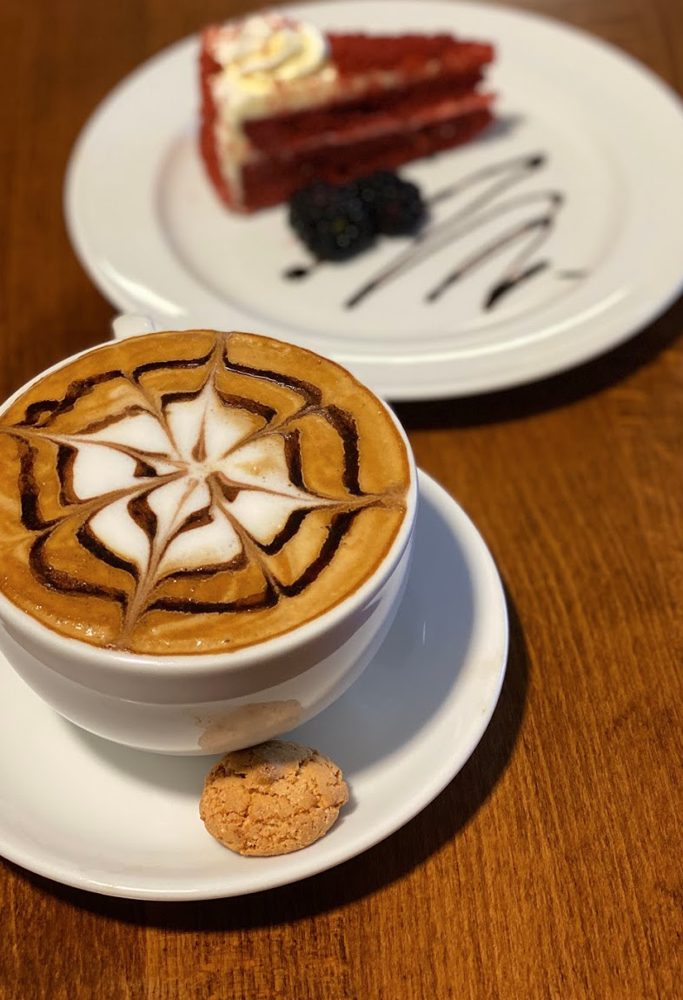\
Reference: Google Business


## 2. L'atelier Patisserie
Address: 260 E 5th Ave, Vancouver, BC V5T 1H3\ 
Website:[https://www.latelierpatisserie.com](https://www.latelierpatisserie.com)\
Phone: (604) 329-6153

- In-store pick-up

\
Reference: Google Business


## 3. Kumme Cafe
Address: 1610 Robson St Unit 104, Vancouver, BC V6G 1C7\
Website: [https://h5.goopter.com/store/840](https://h5.goopter.com/store/840)\
Phone: (604) 559-6600

- In-store pick-up

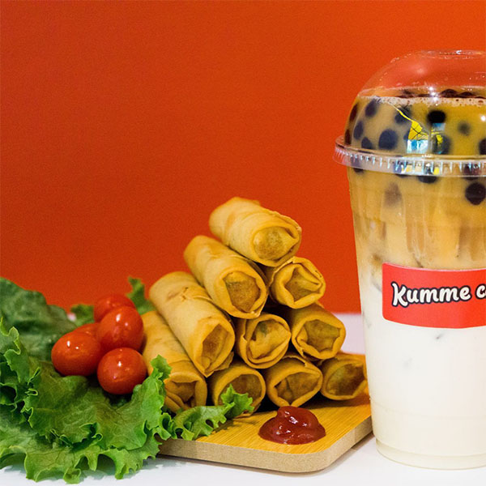\
Reference: Google Business

\
Going along on No.3 Road in Richmond, hundreds of restaurants are here. Actually, The Night Market which is located at 8351 River Rd, Richmond, BC V6X 1Y4, should be the best for snack lovers, however, hope the Pandemic ends ASAP and we can welcome the Night Market back next Summer!

\
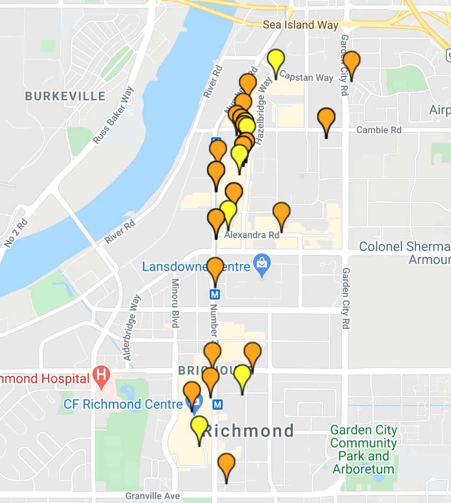\

No worries, snack lovers still have a lot options here!

## 1. Pokey Okey
Address: 8060 Anderson Rd, Richmond, BC V6Y 1S4\
Website: [pokeyokey.com](pokeyokey.com)\
Phone:  (604) 370-0229

- In-store pick-up
- Delivery

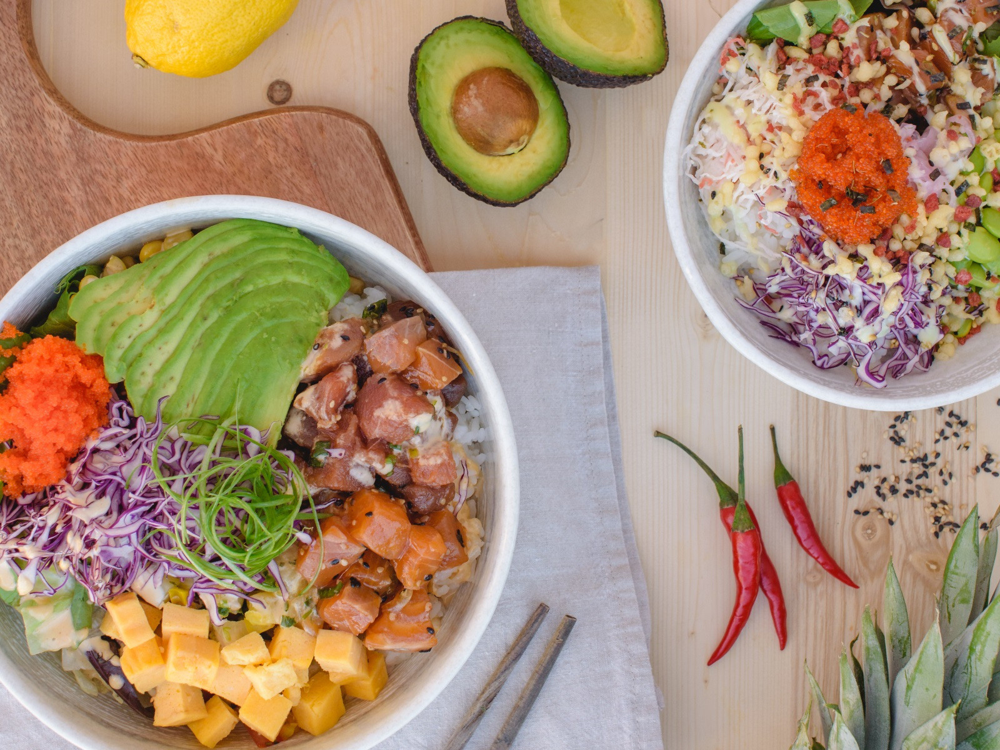\
Reference: Google Business


## 2. Fresh Press Coffee Bar
Address: 4940 Number 3 Rd #121, Richmond, BC V6X 3A5\ 
Website:[https://www.facebook.com/FreshPressCoffeeBar/](https://www.facebook.com/FreshPressCoffeeBar/)\
Phone: (604) 238-7510

- In-store pick-up

\
Reference: Google Business


## 3. Sweet Memory
Address: 8080 Leslie Road Richmond, BC V6X 1E4\
Website: [https://www.memorycorner8.com/](https://www.memorycorner8.com/home/)\
Phone: (604) 559-6600

- In-store pick-up
- Delivery

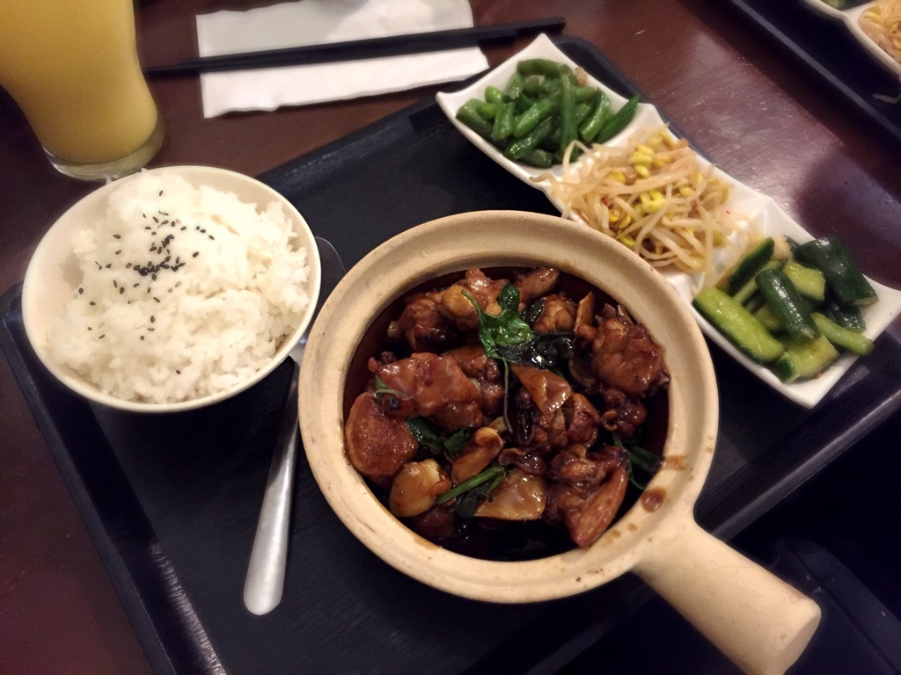\
Reference: Google Business

\
Lastly, we’ll look at the business in Burnaby. Surprisingly we found a lot of multicultural meals there, such as cuisine in Mexican, Ukrainian, Russian, Korean, Turkish, etc. Let’s find them out!

## Ukrainian: Kozak Ukranian Eatery
Address: 5077 Victoria Dr, Vancouver, BC V5P 3T9\
Phone: (604) 428-4421

- In-store pick-up
- Delivery
- Dine in

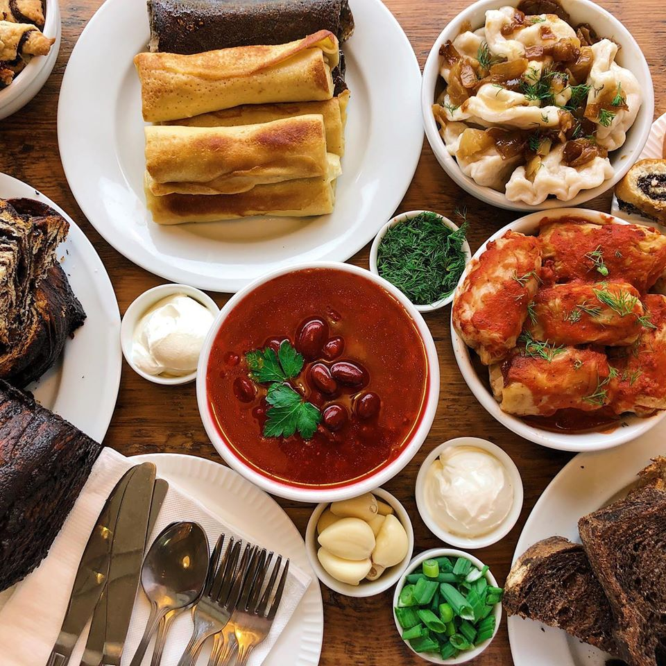\
Reference: Google Business


## Japanese: Ki Tea House Cafe
Address: 6888 Royal Oak Ave Unit #105, Burnaby, BC V5J 4J2\
Phone: (604) 559-7088

- In-store pick-up
- Delivery
- Dine in

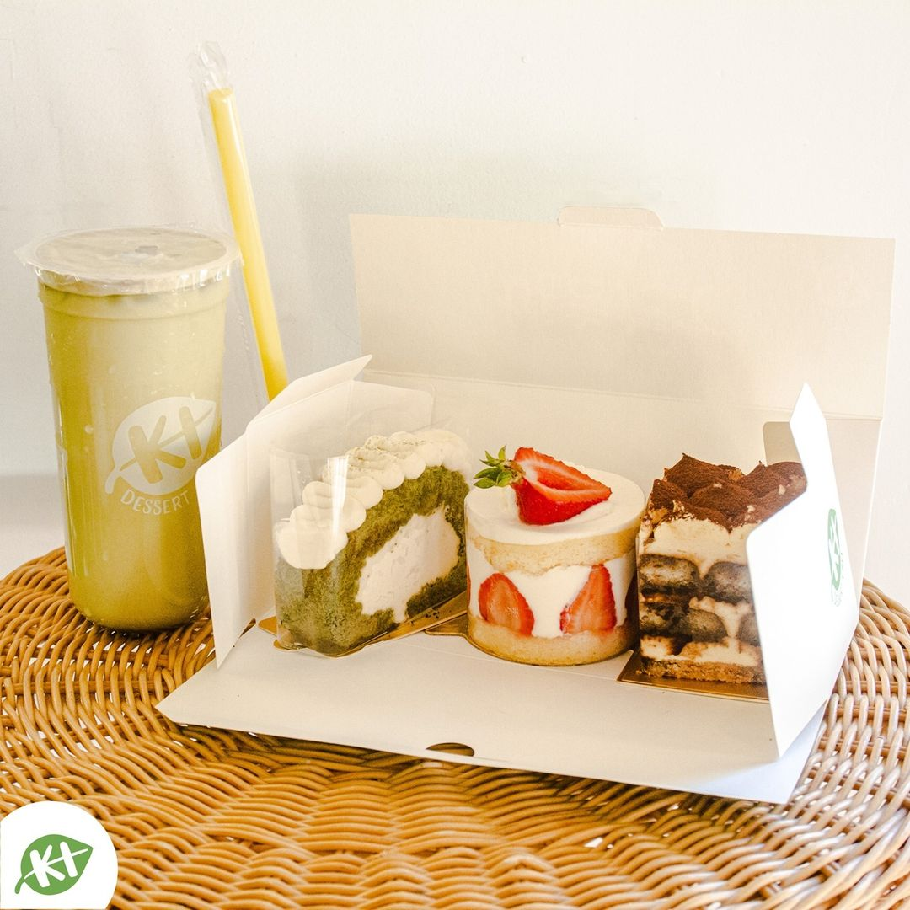\
Reference: Google Business

## Vietnamese: Ba Le Sandwich Shop
Address: 701 Kingsway, Vancouver, BC V5T 2R7\
Phone: (604) 875-0088

- In-store pick-up
- Delivery

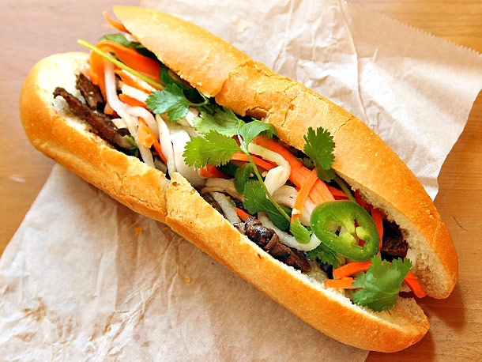\
Reference: Google Business

## Malaysian: Ipoh Bean Sprout Chicken
Address: 2127-4500 Kingsway Burnaby, BC V5H 2B1\
Phone: (604) 442-9208

- In-store pick-up
- Delivery

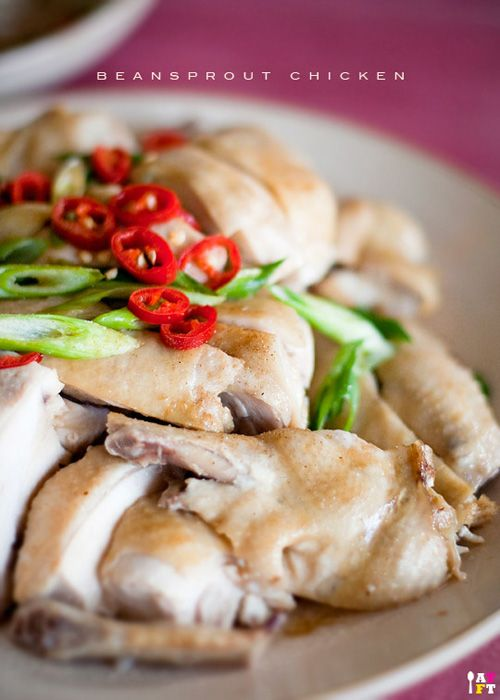\
Reference: Google Business

\
Okay! Did you get any sense on What to eat in Vancouver right now? Follow the list here, you’d never get hungry! 

Feel free to let me know what you'd like to read more, and hope you’ll enjoy what’s on offer every bit as we have.